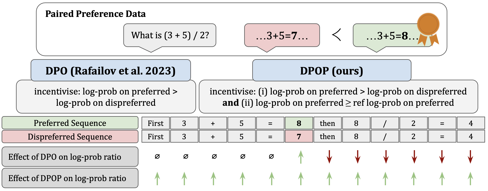

<br/>
<p align="center">
<picture>
  <source media="(prefers-color-scheme: dark)" srcset="image/abacus_logo_dark.png">
  <source media="(prefers-color-scheme: light)" srcset="image/abacus_logo.png">
  
</picture>
</p>
<p align="center"></p>

----

Smaug arrives!

We recently released [Smaug-72B-v0.1](https://huggingface.co/abacusai/Smaug-72B-v0.1) which has taken first place on the Open LLM Leaderboard by HuggingFace. With an average accuracy of 80.48%, it is the first open-source model to surpass an average score of 80%, and it is nearly 2% better than the next-best open-source model. We also released [Smaug-34B-v0.1](https://huggingface.co/abacusai/Smaug-34B-v0.1), the best 34B model at the time of its release. 

We created both models using a new fine-tuning technique, DPOP, and new pairwise preference versions of ARC, HellaSwag, and MetaMath. We introduce both the technique and the datasets in our new arXiv paper: [https://arxiv.org/abs/2402.13228](https://arxiv.org/abs/2402.13228).

We give theoretical and empirical evidence for a failure mode in the standard DPO loss: on datasets in which the edit distance between pairs of completions is low (such as in math-based datasets), standard DPO loss can lead to a _reduction_ of the model's likelihood of the preferred examples, as long as the relative probability between the preferred and dispreferred classes increases. Using these insights, we design DPO-Positive (DPOP), a new loss function and training procedure which avoids this failure mode. Surprisingly, we also find that DPOP significantly outperforms DPO across a wide variety of datasets and downstream tasks, including datasets with high edit distances between completions. Using DPOP, we create Smaug-34B-v0.1 and Smaug-72B-v0.1, which achieve state-of-the-art open-source performance.

<p align="center"></p>

## Table of Contents
1. [Smaug-72B-v0.1](#Smaug-72B-v0.1)
2. [Smaug-34B-v0.1](#Smaug-34B-v0.1)

# Smaug-72B-v0.1 <a name="Smaug-72B-v0.1"></a>

[Smaug-72B-v0.1](https://huggingface.co/abacusai/Smaug-72B-v0.1) is finetuned directly from [moreh/MoMo-72B-lora-1.8.7-DPO](https://huggingface.co/moreh/MoMo-72B-lora-1.8.7-DPO) and is ultimately based on [Qwen-72B](https://huggingface.co/Qwen/Qwen-72B).

The license is therefore the [Tongyi Qianwen LICENSE AGREEMENT](https://github.com/QwenLM/Qwen/blob/main/Tongyi%20Qianwen%20LICENSE%20AGREEMENT).

Please find the model weights [here](https://huggingface.co/abacusai/Smaug-72B-v0.1/tree/main).

### HuggingFace Open LLM Leaderboard Results

| Average | ARC | HellaSwag | MMLU | TruthfulQA | Winogrande | GSM8K |
| --- | --- | --- | --- | --- | --- | --- |
|  80.48  | 76.02 | 89.27  | 77.15 | 76.67 | 85.08 | 78.70 |

#### MT-Bench

We ran MT-Bench with the llama-2 conversation template and the system prompt set to the Qwen system prompt. We got the following
results in single model mode:

| First Turn | Second Turn | Average |
| ---------- | ----------- | ------- |
| 8.18       | 7.34        | 7.76    |

We give sample MT-Bench responses in the [HuggingFace model card](https://huggingface.co/abacusai/Smaug-72B-v0.1).

### Contamination Results

We generate our contamination numbers using https://github.com/swj0419/detect-pretrain-code-contamination/tree/master, with Llama7B as our reference model.
Smaug-72B has the following results:

| ARC | TruthfulQA | GSM8K |
| --- | --- | --- |
| 0.20| 0.45| 1.00|

By comparison, MoMo-72B-lora-1.8.7-DPO has the following results:

| ARC | TruthfulQA | GSM8K |
| --- | --- | --- |
| 0.20| 0.39| 1.00|

Note that GSM8K often scores very highly on this contamination suite - we verified this by also running Llama-2-70B:

| ARC | TruthfulQA | GSM8K |
| --- | --- | --- |
| 0.22| 0.51| 0.89|

# Smaug-34B-v0.1 <a name="Smaug-34B-v0.1"></a>

[Smaug-34B-v0.1](https://huggingface.co/abacusai/Smaug-34B-v0.1) is finetuned directly from [bagel-34b-v0.2](https://huggingface.co/jondurbin/bagel-34b-v0.2) and is ultimately based on [Yi-34B-200k](https://huggingface.co/01-ai/Yi-34B-200K).

The license is therefore the [Yi Series Models Community License Agreement](https://huggingface.co/01-ai/Yi-34B-200K/blob/main/LICENSE).

Please find the model weights [here](https://huggingface.co/abacusai/Smaug-34B-v0.1/tree/main).

### Evaluation Results

| Average | ARC | HellaSwag | MMLU | TruthfulQA | Winogrande | GSM8K |
| --- | --- | --- | --- | --- | --- | --- |
|  77.29  | 74.23 | 86.76  | 76.66 | 70.22 | 83.66 | 72.18 |

### Contamination Results

With reference model jondurbin/bagel-34b-v0.2:

| ARC | TruthfulQA | GSM8K |
| --- | --- | --- |
| 0.08| 0.38| 0.88|

# Citation

Please cite the paper if you use data, model, or method in this repo.

```
@article{luo2023wizardcoder,
  title={Smaug: Fixing Failure Modes of Preference Optimisation with DPO-Positive},
  author={Pal, Arka and Karkhanis, Deep and Dooley, Samuel and Roberts, Manley and Naidu, Siddartha and White, Colin},
  journal={arXiv preprint arXiv:2402.13228},
  year={2024}
}
```
